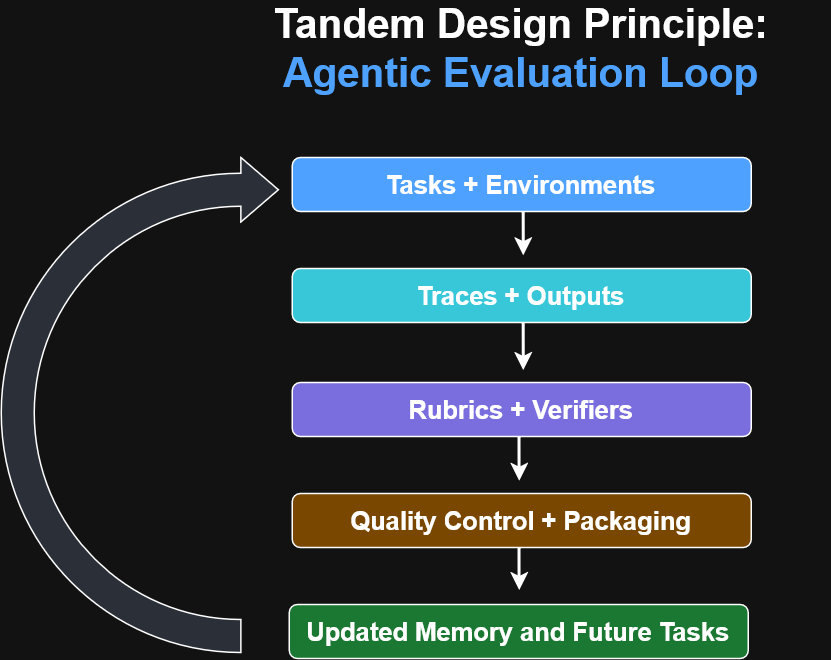

# Continual Learning and Stateful AI Agents

## Core Idea

Traditional agent benchmarks usually treat each task as an independent
episode. The agent receives a task, produces an answer, receives a score,
and then starts the next task without access to its earlier experience.

Continual learning evaluates whether experience from earlier tasks improves
performance on later related tasks.

## Stateless and Stateful Systems

### Stateless Baseline

A stateless agent starts each task fresh.

It cannot retain:

- Repository conventions
- Earlier errors
- Successful commands
- User preferences
- Domain-specific rules
- Previously discovered dependencies

### Stateful Agent

A stateful agent carries selected information across a sequence of tasks.

That state may be stored in:

- Markdown notes
- Project files
- Summaries
- Chat history
- A persistent notepad
- Retrieved memories
- An evolving playbook
- A filesystem-backed workspace

The base language model may remain unchanged. The surrounding memory system
is what allows the complete agent system to learn from experience.

## Continual-Learning Evaluation

Continual Learning Bench runs the same agent system twice:

1. A stateful run in which memory persists.
2. A stateless run in which memory resets after each task.

The task sequence remains the same.

The comparison determines whether access to prior experience improves later
performance.

## Reward and Gain

Reward measures raw task performance.

Gain measures whether retained experience helped:

```text
Gain = Stateful Reward - Stateless Reward
```

---

# Design Principle

## Tandem Design Principle



Tasks and environments should be developed together with traces, outputs,
rubrics, verifiers, quality controls, and memory updates. The resulting
evidence should feed back into future task and environment design.

The article’s most important practical point for your work is that **simple memory can be powerful because it is auditable**. A markdown file or persistent notepad can be inspected and corrected by a person, while more complex retrieval systems may introduce stale or hidden information. :contentReference[oaicite:2]{index=2}

That means your organized GitHub repositories are not just storage. They can become the **persistent memory and evidence layer** behind future AI agents.
